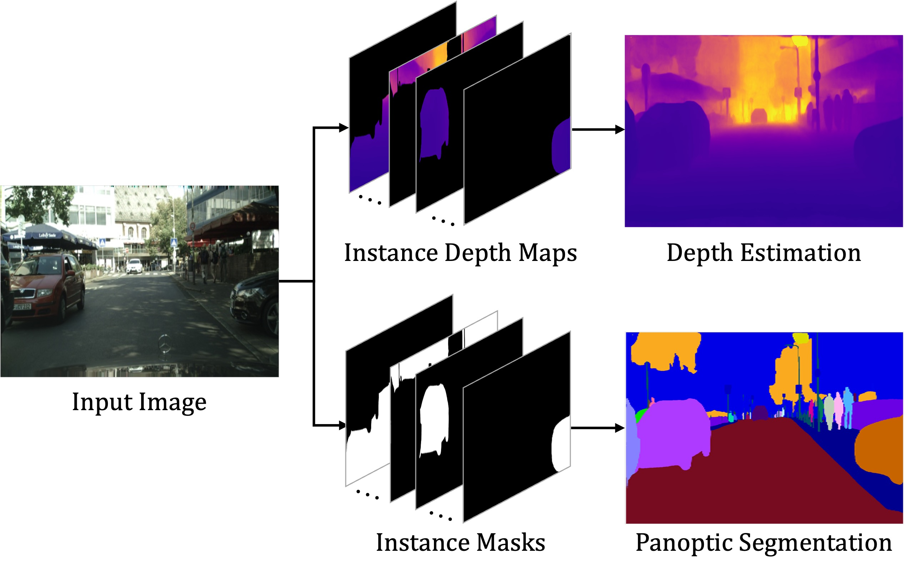

# PanopticDepth: A Unified Framework for Depth-aware Panoptic Segmentation (CVPR2022)
  
[[`arXiv`](https://arxiv.org/)] [[`BibTeX`](#CitingPanopticDepth)]

## Introduction
In this repository,we present a unified framework for depth-aware panoptic segmentation (DPS), which aims to reconstruct 3D scene with instance-level semantics from one single image. Prior works address this problem by simply adding a dense depth regression head to panoptic segmentation (PS) networks, resulting in two independent task branches. This neglects the mutually-beneficial relations between these two tasks, thus failing to exploit handy instance-level semantic cues to boost depth accuracy while also producing sub-optimal depth maps. To overcome these limitations, we propose a unified framework for the DPS task by applying a dynamic convolution technique to both the PS and depth prediction tasks. Specifically, instead of predicting depth for all pixels at a time, we generate instance-specific kernels to predict depth and segmentation masks for each instance. Moreover, leveraging the instance-wise depth estimation scheme, we add additional instance-level depth cues to assist with supervising the depth learning via a new depth loss. Extensive experiments on Cityscapes-DPS and SemKITTI-DPS show the effectiveness and promise of our method. We hope our unified solution to DPS can lead a new paradigm in this area.
<div align="center">
  
</div><br/>

## Installation
This project is based on [Detectron2](https://github.com/facebookresearch/detectron2), which can be constructed as follows.
* Install Detectron2 following the [instructions](https://detectron2.readthedocs.io/tutorials/install.html)
* Copy this project to `/path/to/detectron2/`
* Setup the [Cityscapes dataset](https://github.com/facebookresearch/detectron2/blob/master/datasets/README.md)
* Download the [Cityscapes-DPS dataset](https://github.com/joe-siyuan-qiao/ViP-DeepLab/blob/master/cityscapes-dvps/README.md)
* Setup the Cityscapes-DPS dataset format with `datasets/prepare_dvps_cityscapes.py`

## Training
* Train the panoptic segmentation model
```bash
cd ./projects/PanopticDepth/
python3 train.py --config-file configs/cityscapes/PanopticDepth-R50-cityscapes.yaml --num-gpus 8 OUTPUT_DIR ./output/ps
```

* Finetune the panoptic segmentation model with full scale image inputs
```bash
python3 train.py --config-file configs/cityscapes/PanopticDepth-R50-cityscapes-FullScaleFinetune.yaml --num-gpus 8 MODEL.WEIGHTS ./output/ps/model_final.pth OUTPUT_DIR ./output/ps_fsf
```

* Train the depth-aware panoptic segmentation model
```bash
python3 train.py --config-file configs/cityscapes_dps/PanopticDepth-R50-cityscapes-dps.yaml --num-gpus 8 MODEL.WEIGHTS ./output/ps_fsf/model_final.pth OUTPUT_DIR ./output/dps
```

## Evaluation
To evaluate a pre-trained model with 8 GPUs, run:
```bash
cd ./projects/PanopticDepth/
python3 train.py --eval-only --config-file <config.yaml> --num-gpus 8 MODEL.WEIGHTS /path/to/model_checkpoint
```

## Model ZOO
**Cityscapes panoptic segmentation**
<table><tbody>
<!-- START TABLE -->
<!-- TABLE HEADER -->
<th valign="bottom">Method</th>
<th valign="bottom">Backbone</th>
<th valign="bottom">PQ</th>
<th valign="bottom">PQ<sup>Th</sup></th>
<th valign="bottom">PQ<sup>St</sup></th>
<th valign="bottom">download</th>
<!-- TABLE BODY -->
<tr><td align="left">PanopticDepth (seg. only)</td>
<td align="center">R50</td>
<td align="center"> 64.1 </td>
<td align="center"> 58.8 </td>
<td align="center"> 68.0 </td>
<td align="center"> <a href="https://drive.google.com/file/d/13m0DVJyuGw1Mdnnvcrlb9_i1b-b7cvjM/view?usp=sharing">google drive</a></td>
</tr>
</tbody></table>

**Cityscapes depth-aware panoptic segmentation**
<table><tbody>
<!-- START TABLE -->
<!-- TABLE HEADER -->
<th valign="bottom">Method</th>
<th valign="bottom">Backbone</th>
<th valign="bottom">DPQ</th>
<th valign="bottom">DPQ<sup>Th</sup></th>
<th valign="bottom">DPQ<sup>St</sup></th>
<th valign="bottom">download</th>
<!-- TABLE BODY -->
<tr><td align="left">PanopticDepth</td>
<td align="center">R50</td>
<td align="center"> 58.3 </td>
<td align="center"> 52.1 </td>
<td align="center"> 62.8 </td>
<td align="center"> <a href="https://drive.google.com/file/d/1tFWIwP_SfwdypyjAUH14fHdk3qRbnkdp/view?usp=sharing">google drive</a></td>
</tr>
</tbody></table>

## <a name="CitingPanopticDepth"></a>Citing PanopticDepth

Consider cite PanopticDepth in your publications if it helps your research.

```
@inproceedings{gao2022panopticdepth,
  title={PanopticDepth: A Unified Framework for Depth-aware Panoptic Segmentation},
  author={Naiyu Gao, Fei He, Jian Jia, Yanhu Shan, Haoyang Zhang, Xin Zhao, and Kaiqi Huang},
  booktitle={IEEE Conference on Computer Vision and Pattern Recognition (CVPR)},
  year={2022}
}
```

## Acknowledgements
We have used utility functions from other wonderful open-source projects, we would espeicially thank the authors of:
- [Detectron2](https://github.com/facebookresearch/detectron2)
- [torchvision](https://github.com/pytorch/vision)
- [PanopticFCN](https://github.com/dvlab-research/PanopticFCN)
